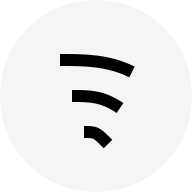

<p align="center">
    <a href="https://radio.baron.pw">
      
    </a>
  </p>
  
  <h1 align="center">Radio Baron</h1>
  
  <p align="center">
    <a href="https://radio.baron.pw"><strong>radio.baron.pw</strong></a> &mdash; listen to radio stations online
  </p>
  
  <p align="center">
    Online radio streaming built with Next.js, React, and Chakra UI.
  </p>
  
  ## Getting Started
  
  ### Prerequisites
  
  - Node.js (LTS recommended)
  - npm or yarn
  
  ### Installation
  
  1. Clone the repository
  2. Copy environment variables:
  
  ```bash
  cp .env.example .env.local
  ```
  
  Fill in Firebase credentials in `.env.local` (see `.env.example`).
  
  3. Install dependencies and start the dev server:
  
  ```bash
  npm install
  npm start
  ```
  
  Open [http://localhost:3000](http://localhost:3000) in your browser.
  
  ## Available Scripts
  
  - `npm start` - Development server with Turbo
  - `npm run build` - Production build
  - `npm run lint` - Run linter
  - `npm run generate-icons` - Generate favicons from SVG logo
  
  ## Built With
  
  - [Next.js](https://nextjs.org/) - React framework
  - [React](https://reactjs.org/) - UI library
  - [Chakra UI](https://chakra-ui.com/) - Component library
  - [Firebase](https://firebase.google.com/) - Auth and realtime database
  - [next-intl](https://next-intl-docs.vercel.app/) - Internationalization
  - [GSAP](https://greensock.com/gsap/) - Animations
  - [Swiper](https://swiperjs.com/) - Touch slider
  
  ## Icon Generation
  
  ```bash
  npm run generate-icons
  ```
  
  Generates favicons and PWA icons in the `public` directory.
  
  ## Environment Variables
  
  Copy `.env.example` to `.env.local` and set:
  
  | Variable | Description |
  |----------|-------------|
  | `NEXT_PUBLIC_FIREBASE_API_KEY` | Firebase API key |
  | `NEXT_PUBLIC_FIREBASE_AUTH_DOMAIN` | Firebase auth domain |
  | `NEXT_PUBLIC_FIREBASE_DATABASE_URL` | Firebase Realtime Database URL |
  | `NEXT_PUBLIC_FIREBASE_PROJECT_ID` | Firebase project ID |
  | `NEXT_PUBLIC_FIREBASE_STORAGE_BUCKET` | Firebase storage bucket |
  | `NEXT_PUBLIC_FIREBASE_MESSAGING_SENDER_ID` | Firebase messaging sender ID |
  | `NEXT_PUBLIC_FIREBASE_APP_ID` | Firebase app ID |
  | `NEXT_PUBLIC_BASE_URL` | Site URL (default: https://radio.baron.pw) |
  
  For production, set the same variables in your Vercel project settings.
  